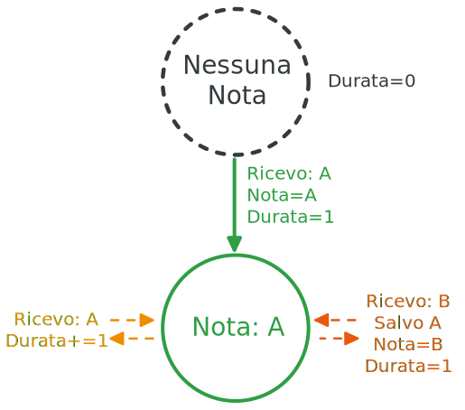
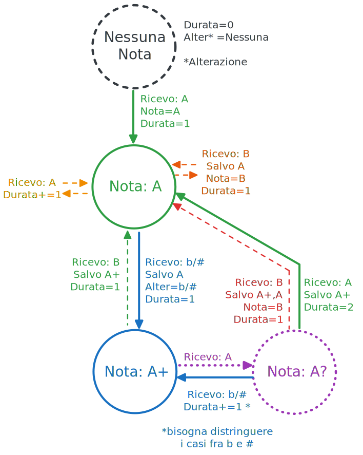

# Keras Library _(HW4)_

E la storia di come ho ottimizzato la mia soluzione rendendola **8 volte più veloce**. La soluzione più veloce in classifica impiega **41ms** per eseguire tutti i test, la mia ne impiega **5**

<!-- TODO: citare le specifiche delle macchine su cui ho eseguito i test -->


## Python 🗑️!


<!-- TABELLA NUMERO FILE E DURATE CANZONI (media e totale) -->


Per i poveretti che hanno dovuto affrontare l'HW4 quest'anno il test più problematico è stato il `test10` per il _Timeout_, come mai? Se si fa una veloce analisi sulla struttura dei test, si scopre che il `test10` ha 181 file e 4919914 caratteri da convertire _(quasi 5 milioni 💀)_. In confronto, il `test03` ha 610 file e 419723 caratteri da convertire in totale _("solo" 420 mila 🌿)_.

| test | # file | # totale caratteri nei file | 
|--|--|--|
| test01 | 18 | 1513 |
| test02 | 15 | 1609 |
| test03 | 613 | 419723 |
| test04 | 11 | 9130 |
| test05 | 34 | 28293 |
| test06 | 25 | 5651 |
| test07 | 18 | 125139 |
| test08 | 17 | 35491 |
| test09 | 11 | 6249 |
| test10 | 181 | 4919914 |

Il `test10` impiega molto più tempo del `test03`, il che, seppur possa sembrare ragionevole, sta mettendo in luce il fatto che l'**algoritmo è tanto lento quanto le operazioni di lettura e scrittura sul disco**. Come si scopre dai benchmark della mia soluzione, il `test03` ci mette il doppio rispetto al `test10` _(senza thread)_, perché in un linguaggio **normale** la traduzione _(in RAM)_ dovrebbe essere **estremamente più veloce** rispetto all'interazione con il disco rigido _(per creare una marea di cartelle e leggere / scrivere una marea di file)_

Ho deciso di usare [Rust](https://www.rust-lang.org/) siccome volevo farci un po' di pratica, è un linguaggio allo stesso livello di C ed è piacevole lavorarci _(perché ha astrazioni come quelle di Python)._

> Don't worry, no snake was harmed during the writing of this post

## Traduzione burlona... 

Ok, inizialmente volevo discutere la parte della traduzione _(perché le altre ottimizzazioni sono più "difficili da spiegare")_. Il primo in classifica ha scritto una cosa del genere:

```python
ZIPPED_REPLACE_MAP = (
    (b'\x00-', b'\x07'), (b'\x01-', b'\x08'),
    (b'\x02-', b'\x09'), (b'\x03-', b'\x0A'),
    (b'\x04-', b'\x0B'), (b'\x05-', b'\x0C'),
    (b'\x06-', b'\x0D'), (b'\x06+', b'\x14'),
    (b'\x00+', b'\x0E'), (b'\x01+', b'\x0F'),
    (b'\x02+', b'\x10'), (b'\x03+', b'\x11'),
    (b'\x04+', b'\x12'), (b'\x05+', b'\x13')
)

def tknz_tarahumara(path: str, out: str) -> int:
    with open(path, "r") as inp:
        content = b"".join(x[::-1] for x in inp.buffer).translate(TABLE, b'\n')
    for t, r in ZIPPED_REPLACE_MAP:
        content = content.replace(t, r)

    tokens = 0
    c = 0
    last = content[0]

    with open(out, "w") as out_f:
        for tkn in content + b"\xff":
            if tkn is last:
                c += 1
                continue
            out_f.write(f"{local_conv[last]}{c}")

            last = tkn
            tokens += c
            c = 1
    return tokens
```

L'algoritmo si può rappresentare con una [FSM](https://en.wikipedia.org/wiki/Finite-state_machine) a 2 stati molto semplice



Qual'è il problema di questa implementazione? Il fatto che le note alterate, `'Xb'`, sono composte da 2 caratteri. La soluzione più veloce _(in Python)_ per ovviare a questo problema è usare **14** `.replace()` per rimpiazzare tutte le **note alterate** con **byte singoli** (ad esempio: `'4+'`, `0x042b'` in esadecimale 2 byte, viene trasformato in `'0x12'`, in esadecimale 1 byte). 

Quando una sequenza viene salvata va riconvertita nella rispettiva nota con un **dizionario**.

### L'alternativa?

Ok, ora pensiamo all'FSM alternativa senza l'utilizzo di `.replace()` e di `dict()` per le conversioni, quindi vanno considerati i caratteri `'b'` e `'#'` separatamente



Sembra complessa, ma si può implementare senza grandi difficoltà con qualche `if`, e il vantaggio è che permette di **iterare il testo 1 volta sola**, rispetto alle **14 iterazioni** che bisogna fare con i vari `.replace()`. Perché non usiamo questa soluzione? Perché l'implmentazione della seconda FSM in Python è molto più lenta rispetto ad usare i **14** `.replace()`, visto che usare **if** nel **for** in Python è un'operazione **LENTISSIMA!** Il vantaggio di `.replace()` è proprio quello di essere implementato in C, quindi non soffre quasi per nulla la lentezza di Python. 

Per fortuna, nei linguaggi come **Rust**, **C++** e **C**, il costo dell'**if** è quasi 0, per questo ho deciso di implementare la seconda FSM nella mia traduzione, ma come ho fatto? All'inizio, definiendo i possibili stati

```Rust
// Ho usato la terminologia inglese per *elencare* i tipi di note 

enum Note {
    None,
    Normal, // Nota semplice
    Accidental, // Nota alterata (con b o #)
    Unknown, // Nota: A? (non so se è semplice o alterata)
}

/* 
"Unknown" si verifica con la sequenza "AbA" perché
non so se l'ultima 'A' è semplice o alterata finché
non leggo il carattere dopo
*/ 
```

Il prossimo step è quello di leggere i dati dal file _(qui sopravvive solo la vesione migliore, se volete vedere le altre c'è la commit history del repository e ci sono i test)_

```rust
let (translation, duration) = translate(
	&read(source_folder.join(&file))
		.unwrap()
		.iter()
		.map(|byte| match byte {
			10 => '\n',
			32 => 'P',
			43 => '#',
			45 => 'b',
			byte => (byte + 17) as char,
		})
		.collect(),
);
```

Con `read(source_folder.join(&file)).unwrap()` leggo i **byte** dal file della canzone e gestisco eventuali **errori di lettura**. Successivamente con `.iter().map(|byte| match byte ...)` non faccio altro che iterare su ogni singolo **byte** (quindi numero), e convertirlo nel rispettivo **carattere umkansaniano** e con `.collect()` trasformo i byte letti in un `Vec<char>`, che sarebbe il corrispettivo di **List** in Rust _(grossolanamente)_.

Adesso che ho una lista di caratteri su cui lavorare, posso implementare l'FSM!

```rust
// Ho tagliato alcuni pezzi, potete vedere il codice completo nel file src/thread/pool.rs

pub fn translate(score: &Vec<char>) -> (String, i32) {
    let mut song_duration = 0;
    let mut note = ' ';
    let mut accidental = ' ';
    let mut duration = 0; // Durata della sequenza attuale
    let mut note_type = None;
    let mut translation = String::new();

    for staff in score.split(|char| char == &'\n') {
		// 'score' è il termine inglese per spartito 
		// 'staff' è il termine inglese per pentagramma 

        for &symbol in staff.iter().rev() {
			// Ad ogni iterazione aggiorno lo stato aggiornando note_type

            note_type = if symbol == note {
                song_duration += 1;

                match note_type {
                    Normal => {
                        duration += 1;
                        Normal
                    }
                    Accidental => Unknown,
                    Unknown => {
                        duration = 2;
                        Normal
                    }
                    _ => unreachable!(),
                }
            } else {
                match symbol {
                    '#' | 'b' => {
                        match note_type {
                            Normal => {
                                duration = 1;
                                accidental = symbol;
                            }
                            Unknown => {
                                if symbol == accidental {
                                    duration += 1;
                                } else {
                                    duration = 1;
                                    accidental = symbol;
                                }
                            }
                            _ => unreachable!(),
                        };

                        Accidental
                    }
                    _ => {
                        song_duration += 1;
                        note = symbol;
                        duration = 1;
                        Normal
                    }
                }
            }
        }
    }

    (translation, song_duration)
}
```

Ci sono alcune osservazioni interessanti:
- Se il simbolo letto è uguale al precedente, il simbolo non può essere né `'b'` né `'#'`
- Se il simbolo letto è diverso dal precedente e non è né `'b'` né `'#'` allora ricado sempre nello stato `Normal`, dato che ho una nota diversa dalla precedente

> Ho levato le righe di codice in cui salvo le sequenze, per cui non si vede che per aggiornare la traduzione uso la macro `write!()` che ho scoperto essere la strategia più veloce per aggiornare la stringa con un formato custom _(visto che convertire un numero intero in una sequenza di cifre è abbastanza costoso)_

La lettura dall'alto verso il basso e da destra verso sinistra è altrettanto semplice come in Python

```rust
for staff in score.split(|char| char == &'\n') {
	for &symbol in staff.iter().rev() {
	}
}
```

Con `.split()` divido lo **spartito** in **pentagrammi**, e con `.iter().rev()` inverto ogni pentagramma. Al posto di `.split(|c| c == &'\n')` avrei potuto usare semplicemente `.lines()`, ma è leggermente più lento perché controlla anche il carttere `'\r'` o il fatto che ci sia `"\r\n"` 


L'altra cosa interessante è che mancano i `return`, perché di default, in Rust, se sono all'interno di un blocco parentesi graffe, e l'ultimo **statement** non ha il `;`, quello è il valore di ritorno del blocco.

```rust
_ => {
	song_duration += 1;
	note = symbol;
	duration = 1;
	Normal
}
```

In questo esempio il valore di ritorno del blocco `{}` è `Note::Normal`

Questa regola si può applicare un po' da tutte le parti, quindi posso fare cose interessanti come far ritornare un valore ad un blocco `if {} else {}` 

```rust
let avvertenza = if velocita > limite {
	"Stai superando il limite di velocità!"
} else if velocita <= 10 {
	"Muovi il c***!"
} else {
	"Tutt'appost"
}
```

> Per altre curiosità su Rust, il miglior posto è il [libro ufficiale](https://doc.rust-lang.org/book/)

## Il pezzo forte: parallelismo ⚒️ 

Non ci basta essere più veloci di Python, vogliamo distruggerlo proprio 💣. Visto che i nostri PC hanno una marea di **core**, è giunto il momento di **sfruttarli tutti a pieno!**

Immaginate di avere **600 documenti da tradurre**, e farli analizzare da una sola persona che li traduce uno alla volta... è logico che se assumo più persone possono tradurre i file contemporaneamente, quindi **finire prima il lavoro**. Supponiamo in maniera malsana di assumere **una persona per ogni documento**: questo è quello che ho fatto nella prima soluzione parallela, quella in `src/thread/mod.rs`.

Quindi, nel `test03` creavo **613 thread** per tradurre i file, nel `test10` ne creavo **181** e così via. Per chi non sapesse cos'è un **thread**, deve immaginarlo come **una funzione che eseguo separatamente dal mio codice "principale"**, quindi, avendo più core, posso eseguire il codice "principale" e queste funzioni separate **contemporaneamente**. 

Questa **NON è la soluzione finale**, ma prima di spiegare la prossima ottimizzazione, vorrei dare un'occhiata al **compito** di ciascun **thread**

```rust
let (tx, rx) = channel(); 

thread::spawn(move || {
	// Questa parte l'abbiamo già vista prima 😁
	let (translation, duration) = translate(
		&read(source_folder.join(&file))
			.unwrap()
			.iter()
			.map(|byte| match byte {
				10 => '\n',
				32 => 'P',
				43 => '#',
				45 => 'b',
				byte => (byte + 17) as char,
			})
			.collect(),
	);

	// Controllo se qualche altro thread ha creato il percorso di destinazione di questa canzone
	let target_file = target_folder.join(&file);
	let target_path = target_file.parent().unwrap();
	if !target_path.exists() {
		// Se non dovesse esistere, lo creo io
		create_dir_all(target_path).unwrap();
	}

	// Salvo la traduzione nel file di destinazione
	write(
		target_file.with_file_name(&title).with_extension(".txt"),
		translation,
	)
	.unwrap(); // Controllo eventuali errori

	// Invio al codice "principale" il titolo della canzone tradotta e la sua durata!
	tx.send((title, duration)).unwrap();
});
```

Ogni thread si occupa di leggere il file, convertirne i byte, contare e salvare le note, creare la cartella di destinazione se non esiste, salvare la traduzione e **inviare al codice principale titolo e durata della canzone di cui si è occupato**.

Quest'ultima parte è interessante perché in Rust si fa con i `channel()`, [canali di comunicazione](https://doc.rust-lang.org/book/ch16-02-message-passing.html). Nella prima riga, `tx` è il trasmettitore, e `rx` il ricevitore _(che verrà usato dal codice principale per raccogliere insieme tutti i risultati dei vari thread)_. Di fatto, il thread usa `tx.send()` per invare il dato.

> La sintassi `move || {}` dentro a `thread::spawn()` non fa altro che creare quella che in Python è una **lambda** _(sono simili, ma non la stessa cosa, dato che `|| {}` si comporta come una funzione normale)_

### ...c'è un pezzo da pagare...

Ebbene, creare **600 thread** non è gratis. Di fatto il costo è così **alto** su Linux che la versione con i thread ci impiega lo stesso tempo della versione senza thread sul `test03`. La soluzione è facile: basta creare un numero fisso di thread, e distribuire le varie canzoni fra questi thread. Facendo qualche test si scopre che da un certo punto in poi la velocità inizia a peggiorare (12 thread per la mia architettura). 

Ora vi posso presentare la soluzione finale

```rust
static POOL_SIZE: usize = 12;

pub fn umkansanize(source_folder: &Path, target_folder: &Path) -> HashMap<String, i32> {
    let (tx, rx) = channel();

    scope(|scope| {
        let mut channels = vec![];

        for _ in 0..POOL_SIZE {
            let (song_tx, songs_rx) = channel();
            let tx = tx.to_owned();
            channels.push(song_tx.to_owned());

            scope.spawn(move || {
                for (title, file) in songs_rx.iter() {
                    let (translation, duration) = translate(
                        &read(source_folder.join(&file))
                            .unwrap()
                            .iter()
                            .map(|byte| match byte {
                                10 => '\n',
                                32 => 'P',
                                43 => '#',
                                45 => 'b',
                                byte => (byte + 17) as char,
                            })
                            .collect(),
                    );

                    let target_file = target_folder.join(&file);
                    let target_path = target_file.parent().unwrap();
                    if !target_path.exists() {
                        create_dir_all(target_path).unwrap();
                    }

                    write(
                        target_file.with_file_name(&title).with_extension(".txt"),
                        translation,
                    )
                    .unwrap();

                    tx.send((title, duration)).unwrap();
                }
            });
        }

        read_to_string(source_folder.join("index.txt"))
            .unwrap()
            .split('\n')
            .filter_map(|line| {
                line.strip_prefix('"')
                    .and_then(|s| s.strip_suffix('"').and_then(|s| s.split_once("\" \"")))
            })
            .enumerate()
            .for_each(|(index, (title, path))| {
                channels[index % POOL_SIZE]
                    .send((title.to_owned(), path.to_owned()))
                    .unwrap()
            });
    });

    drop(tx);
    let mut songs: Vec<_> = rx.iter().collect();
    songs.sort_unstable_by_key(|(title, duration)| (-duration, title.to_owned()));

    let mut s = String::new();
    for (title, duration) in songs.iter() {
        writeln!(s, "\"{title}\" {duration}").unwrap();
    }
    write(target_folder.join("index.txt"), s).unwrap();

    songs.iter().map(ToOwned::to_owned).collect()
}
```

Ora conviene analizzare un pezzo alla volta... _(ometto la funzione `translate()` avendola già discussa) 

```rust 
scope(|scope| {
    let mut channels = vec![];
})
```

`scope()` è una funzione estremamente utile, perché fa in modo che **tutti i thread finiscano l'esecuzione** prima di poter procedere. In questo caso, devo aspettare che tutte le canzoni vengano analizzate prima di ordinarle e salvarle nell'`index.txt` della `target_folder`. L'altra cosa utile in questa riga è la **lista** `channels`, che sono una serie di **12 trasmettitori** che userò per **distribuire le 600 canzoni ai 12 thread**

Il comportamento dei thread è simile, se non per questo `for` dato che ogni thread deve analizzare più di una canzone.

```rust
scope.spawn(|| { for (title, file) in songs_rx.iter() { } ... })
```

### La fine dell'inizio...

Ora possiamo finalmente vedere come viene letto il file `index.txt`, e analizzato per ricavare **titolo** e **file** di ogni canzone

```rust
read_to_string(source_folder.join("index.txt"))
	.unwrap() // Leggo il file in una stringa
	.split('\n') // Divido le righe
	.filter_map(|line| { 
		line.strip_prefix('"')
			.and_then(|s| s.strip_suffix('"').and_then(|s| s.split_once("\" \"")))
	})
	.enumerate() // Stessa cosa di Python 
	.for_each(|(index, (title, path))| {
		/* 
			Distribuisco titoli e file delle canzoni ai vari thread
			Usando l'operatore %
		*/
		channels[index % POOL_SIZE]
			.send((title.to_owned(), path.to_owned()))
			.unwrap()
	});
```
> Se non sai cos'è l'operatore `%` (modulo) [qui c'è una spiegazione](https://stackoverflow.com/questions/17524673/understanding-the-modulus-operator)

In particolare, dentro a `.filter_map()` trasformo ciascuna riga in una tupla e prendo solo i valori che sono validi.

| Trasformazione | Operatore |
|--|--|
| "The daily dinner misspells imagination." "17.txt" | 
| The daily dinner misspells imagination." "17.txt" | `.strip_prefix('"')`
| The daily dinner misspells imagination." "17.txt | `.strip_suffix('"')`
| (The daily dinner misspells imagination., 17.txt) | `.split_once("\" \"")`

Ci sono modi molto più puliti per fare questa cosa, ma questo era il più  veloce. Comunque, SI, Rust è talmente figo che posso leggere un file, elaborarlo e inviare i dati a thread tutto in una sola riga, e comunque scrivere codice pulito.

```rust
// Colleziono i risultati dei thread in una "lista"
let mut songs: Vec<_> = rx.iter().collect(); 

// Ordino la lista
songs.sort_unstable_by_key(|(title, duration)| (-duration, title.to_owned()));

// Converto la lista in una stringa
let mut s = String::new();
for (title, duration) in songs.iter() {
	writeln!(s, "\"{title}\" {duration}").unwrap();
}

// Salvo la stringa nel file index.txt di destinazione
write(target_folder.join("index.txt"), s).unwrap();

// Converto la lista in un dizionario e ritorno il dizionario
songs.iter().map(ToOwned::to_owned).collect()
```

Finalmente abbiamo raggiunto l'ultimo blocco! E ci sono solo un paio di cose divertenti da spiegare `sort_unstable_by_key` non è **unstable** perché sta per esplodere, ma perché non garantisce l'ordine relativo... mi spiego meglio:

Se voglio ordinare la lista `['Banana', 'Abete', 'Alce', 'Carciofo']` solo usando la prima lettera di ogni parola, un sort **stable** **garantisce** che l'**ordine relativo** di due elementi uguali sia **mantenuto** (`'Abete'` e `'Alce'` hanno chiavi uguali siccome iniziano entrambe con `'A'`), quindi `['Abete', 'Alce', 'Banana', 'Carciofo']` è l'unico ordine valido. Se l'algoritmo è **unstable**, anche `['Alce', 'Abete', 'Banana', 'Carciofo']` è un ordinamento valido, visto che `'Alce'` e `'Abete'` iniziano entrambe con la `'A'`, e l'algoritmo non garantisce che l'ordine relativo sia mantenuto _(sono tutte cose che si vedono nel corso di algoritmi)._ In questo caso ha senso usare un algoritmo di ordinamento **unstable** dato che non capita che due canzoni abbiano lo stesso titolo (visto che nel dizionario le chiavi dovrebbero essere tutte diverse) ed è leggermente più veloce rispetto a quello **stable** nel caso medio.


```rust
songs.iter().map(ToOwned::to_owned).collect()
```

L'ultima cosa interessante _(e poi vi lascio in pace)_ è quel **ToOwned::to_owned**: in linguaggi come **C**, **C++** e **Rust** si ha a che fare direttamente con la memoria _(tutta roba che Python vi nasconde praticamente)_, e in **Rust** la memoria può appartenere ad una sola variabile alla volta. Quando la funzione `umkansanize()` termina, la memoria della "lista" `songs` viene eliminata. Quindi, per poter ritornare il dizionario, devo dire che la memoria di `songs` adesso è di proprietà della funzione che ha chiamato la mia funzione! (un impiccio, ve?) Questo paradigma si chiama **Ownership**, ed è stato introdotto proprio da Rust per evitare tutti quelli che sono problemi di memoria quando si lavora con linguaggi "vicini alla macchina". 

## In conclusione

Spero che la lettura di questo paragafo vi sia piaciuta e abbiate imparato qualcosa di nuovo (per lo meno avete visto un linguaggio diverso che conoscono in pochi). Mi sono divertito abbastanza con questo homework. Avrei potuto trascrivere molte più informazioni, ma vi avrei solo annoiato e ci ho già dedicato troppo tempo _(fuggo a studiare per i 4 esami che devo dare...)._ Se siete arrivati fino a qui, **buona fortuna per gli esami!**

# FIN
